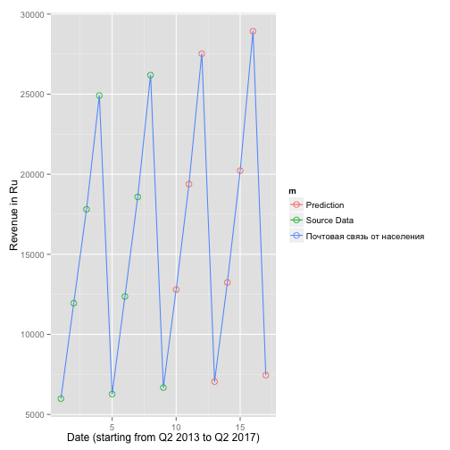

Ministry of IT Open Data Visualization
========================================================
author: Alexander Trubin
date: 22/08/2015

Ministry of IT Open Data Visualization
========================================================

Shiny application gets open data regarding revenues from 
different telecommunications services. 
Data resides on the official site of the Ministry of IT 
of Russian Federation.
Application tries to predict metric's future values.

- http://minsvyaz.ru/
- https://trubin.shinyapps.io/MinSvyazOpenData/

Example of metrics forecasting
========================================================

 

Source code 
========================================================

Source code for the application can be found here:

- https://github.com/atrubin/MinSvyazOpenData/

Questions? 
========================================================

Alexander.Trubin@gmail.com

Thank you!

